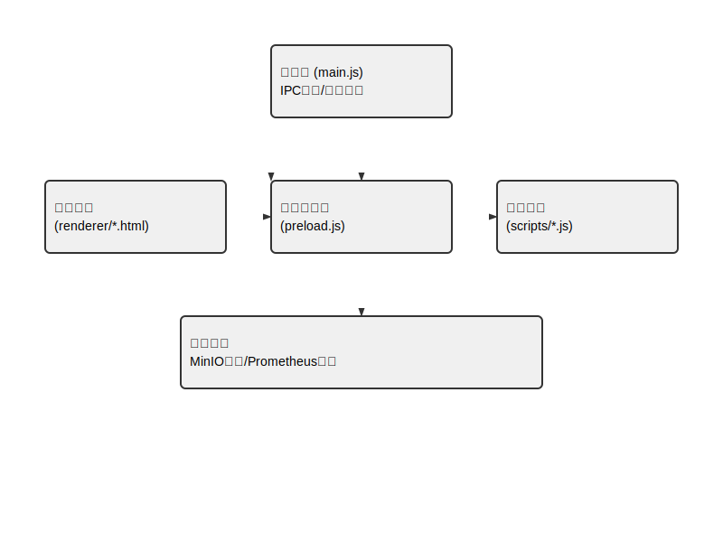

# 中商Electron项目交接文档

## 项目概述


### 核心技术栈
- Electron 23.0.0
- Chromium 108.0.5359
- Node.js 16.15.1

### 数据流向
1. 渲染进程 → preload.js → 主进程
2. 主进程 ↔ scripts构建脚本
3. 自动更新服务 ↔ MinIO存储
基于Electron的桌面应用程序，包含：
- 用户登录系统（renderer/login.html）
- 主界面功能模块（renderer/main.html）
- 浏览器功能模块（renderer/browser.html）
- 用户管理界面（renderer/user-list.html）

## 项目结构
```
├── main.js         主进程
├── preload.js      预加载脚本
├── renderer/       渲染进程
│   ├── *.html     界面文件
│   └── *.js       界面逻辑
└── scripts/       构建脚本
    ├── build-and-upload.js  自动化构建
    └── chromium-manager.js  Chromium管理
```

## 环境要求
- Node.js 16+
- npm 8+
- Chromium浏览器（通过scripts/download-chromium.js安装）

## 构建步骤
### 自动化构建流程
```javascript
// scripts/build-and-upload.js核心逻辑
async function buildAndUpload() {
  await electronBuilder.build()
  const installerPath = path.join(__dirname, '../dist')
  await minioClient.fPutObject('releases', version, installerPath)
  updateFeedUrl = `${MINIO_ENDPOINT}/releases/${version}`
}
```

### 签名配置（buildscript.config.json）
```json
{
  "win": {
    "certificateFile": "./certs.pfx",
    "certificatePassword": "$ENV.CERT_PASS"
  }
}
```
```bash
# 安装依赖
npm install

# 开发模式
npm run start

# 构建安装包
npm run build
```

## 核心配置
- `dev-app-update.yml` 自动更新配置
- `.npmrc` 私有仓库配置
- `package.json` 包含所有依赖和脚本

## 部署流程
1. 运行构建脚本生成安装包
2. 使用scripts/upload-to-minio.js上传到MinIO存储
3. 通过electron-builder生成自动更新凭证

## 常见问题处理
- Chromium下载失败：检查scripts/download-chromium.js的网络配置
- 自动更新失败：验证dev-app-update.yml的服务器配置
- 界面白屏：检查preload.js的进程通信逻辑

## 系统维护
### 版本策略
- 每周三发布hotfix版本（v1.2.x）
- 每月最后一个周五发布feature版本（v1.x.0）

### 监控指标
```bash
# Prometheus监控指标端点
curl http://localhost:9090/metrics
```

## 维护联系人
- 前端维护：前端团队@company.com
- 构建支持：DevOps团队@company.com